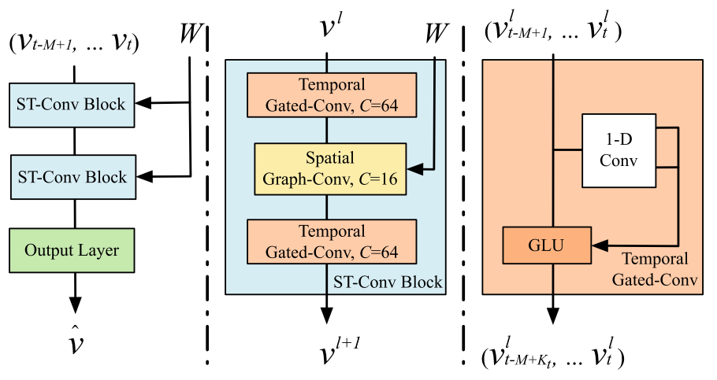

# STGCN
A PyTorch implementation of the paper https://arxiv.org/abs/1709.04875 


Spatio-Temporal Graph Convolutional Networks (STGCN), author's code repo: https://github.com/VeritasYin/STGCN_IJCAI-18.




## Requirements

PyTorch >= 1.1.0

DGL >= 0.4.3.post2

Other dependencies: Please refer to the code


## Single-Step Ahead Forecasting

Run with following to train ```STGCN``` on the METR-LA dataset:

```
python train_stgcn.py
```

Run with following to train ```STGCN_WAVE``` on the METR-LA dataset:

```
python train_stgcn_wave.py
```


### Implementation details:

As for layers:

+ ```TemporalConvLayer_Residual``` is same as author's implementation
+ ```SpatialConvLayer``` is based on DGL's GCN
+ ```OutputLayer``` is same as author's implementation

As for network:

+ ```STGCN``` has the same default structure of author's implementation with ```TSTN+TSTN+OutputLayer```, i.e. Two ST-blocks with the output layer. The main difference is that```SpatialConvLayer``` has different ```in_channel``` and ```out_channel```, i.e. ```c_in``` != ```c_out```.
+ ```STGCN_WAVE``` is an improved variation of ```STGCN``` where the main differences are:
  + Extra ```TemporalConvLayer``` and ```LayerNorm``` at the beginning, the default structure is ```TN+TSTN+TSTN+OutputLayer```
  + ```TemporalConvLayer``` with increasing dilation like in TCN, i.e. 2, 4, 8, 16, etc
  + ```SpatialConvLayer``` does not change the channel size like in author's implementation, i.e. ```c_in```=```c_out```


### Parameter settings:

METR_LA: 34272 samples, 207 nodes, 5 mins sampling rate

PEMS-BAY: 52116 samples, 325 nodes, 5 mins sampling rate


STGCN paper default parameters: window = 12 (60 mins), horizon = 3, 6, 9 (15, 30, 45 mins), batch_size = 50, epoch = 50, lr = 0.001 with a decay rate of 0.7 after every 5 epochs, opt = RMSProp, temporal convolution kernel size = 3, graph convolution kernel size = 3, channels for the ST-Conv block are 64, 16, 64, dropout = 0.0


Our default parameters for ```STGCN``` : ```window``` = 12 (60 mins), ```horizon``` = 3, 6, 9 (15, 30, 45 mins), ```batch_size``` = 64, ```epoch``` = 50, ```lr``` = 0.001 with a ```decay rate``` of 0.7 after every 5 epochs, ```opt``` = Adam, ```Kt``` = 3, ST-Conv block with the ```channels``` = [64, 16, 64], ```dropout``` = 0.3


### Results:

```STGCN``` results on our default parameters (```horizon```=3) are:


```
+------------------------------------------------------------+
|                          Input                             |
+------------------------------------------------------------+
|  1D Conv, in_channel = 1, out_channel = 64, dilation = 1  |
+------------------------------------------------------------+
|       Graph Conv, in_channel = 64, out_channel = 16        |
+------------------------------------------------------------+
|  1D Conv, in_channel = 16, out_channel = 64, dilation = 1  |
+------------------------------------------------------------+
|               Layer Normalization + Dropout                |
+------------------------------------------------------------+
|  1D Conv, in_channel = 64, out_channel = 64, dilation = 1  |
+------------------------------------------------------------+
|       Graph Conv, in_channel = 64, out_channel = 16        |
+------------------------------------------------------------+
| 1D Conv, in_channel = 16, out_channel = 64, dilation = 1 |
+------------------------------------------------------------+
|               Layer Normalization + Dropout                |
+------------------------------------------------------------+
|                      OutputLayer                           |
+------------------------------------------------------------+
```


METR-LA: ~ MAE: 4.70 | RMSE: 9.09

PEMS-BAY:   Upcoming...


## To-Do:

+ Masked metrics calculation